## **Racing League Tools**

## **FLEX RENDERER**

## **MANUAL / DOCUMENTATION**

v0.9.5

# **Introduction**

Racing League Tools (RLT) app's version 0.7.0 introduces a new 2d graphics rendering engine. It uses a special language for describing markup, fundamentally similar to the various XML languages, especially close to XAML. However, currently only the **json** format is supported.

**Theme** - is a complete set of files (markup, images, fonts, etc), describing how to generate images based on data from the app. The app comes with a default theme, but custom themes are also supported. The renderer can only work with one theme at a time.

Fundamentally, a theme is a folder that includes at least a file-describing the theme in general, folder(s) with layouts that include 1 or more layers.

It is recommended to use Visual Studio Code to edit json files. It's lightweight, powerful and user-friendly text editor. The extension for VS Code "RLT Theme Helper" (https://marketplace.visualstudio.com/items?itemName=Kaaac.rlt-theme-helper) by Kaac makes it much easier to create and edit themes.

RLT supports comments in json files (" // commentary "). This is forbidden by the standard json format specification. However, this was done for convenience.

To create a new theme use main menu -> "Themes" -> "Create a new theme":

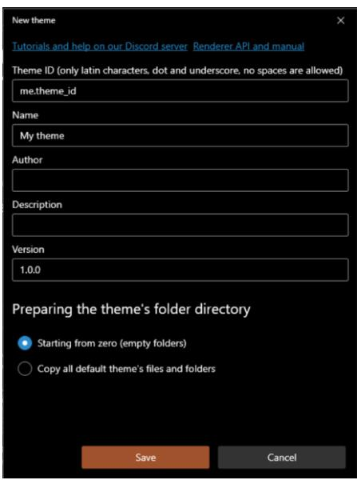

To manage of the installed themes, use main menu -> "Manage themes…":

| Themes |  |  |  |  |  |  |  |  |  |  | × |
| --- | --- | --- | --- | --- | --- | --- | --- | --- | --- | --- | --- |
| Theme setups: | default | V の | @ Manage setups ... |  |  | Browse more themes on our Discord |  | Download / update theme ... |  | C Refresh list | O Open themes folder ... |
| Active | Preview (main) |  | Preview Name |  | Author | Description | Version | Layouts | Links | Options |  |
|  | CATEGORY 1 - F1 TM Discr 1 6 Charles Lection Courge Runnel | 1.26 . 160 |  | Default | Sirotkin | Racing League Tools default theme | 1.1 | 18 |  | భ్రీకి |  |
|  | CATEGORY 1 - F1 TM Charles Lector 1 61 @ George Runnel | 1,24,764 |  | Test theme | Sirotkin | Just test theme for debuging 0.9.5 | 0.1 | 19 |  | భ్రీక |  |

## **Basic principles**

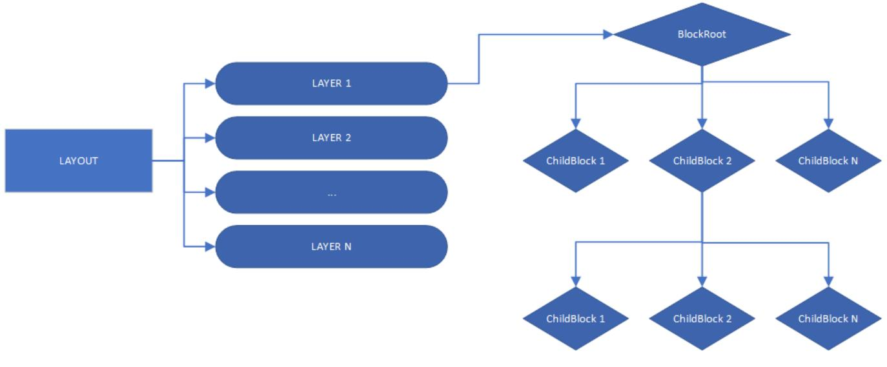

A theme is a collection of **layout**. Each layout generates a finished final image. Layout, in turn, is a collection of **layers**. Each layer also generates an image, but they are overlapped to produce the final image. Any layout must have at least 1 layer.

A layer is a hierarchical structure of **blocks**. Each block is a graphic primitive (text, image, container for other blocks). Any layer starts with BlockRoot, it's actually a regular block, but it's at the root of the composition. Typically, BlockRoot is a container, which allows to have a complex composition of blocks in a layer.

# **Folders structure**

The theme should store all the necessary files in the one folder:

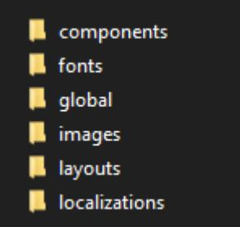

The default theme is located in <app_root> / theme_default /. **Don't touch this folder in any case!**

Custom themes are located in <app_root> / user / themes /.

- **theme_description.json**– required file.
- **Layouts**– storage of layouts. Required folder.
- Components storage of components that can be reused.
- Styles– storage of global styles.
- Vars – json files in which variables are defined.
- Triggers- storage of triggers that can be reused.
- Fonts –storage of fonts.
- Globals - here can be located global_vars.json, public_properties.json files.
- Images main folder for images. When a layer references an image, it looks for the desired file in that folder.
- Localizations- here can be located localization files. File names are custom.

### **theme_description.json**

- **ThemeId** : restricted string global unique identifier of the theme. Only Latin letters, numbers, symbols ".", "_" are allowed. Required. Agreement - specify first the author of the theme, then the dot symbol, then the name of the theme. Example:
"ThemeId" : "me.my_theme".

- Name : string theme name, required. Displayed in the app's UI.
- Author : string required.
- Description : string optional.
- Version : restricted string theme version, optional. The following format is recommended: "Version" : "1.0.0"
- DownloadUrl : string theme zip file link, optional.
- DefaultLocalizationId : string defines the default localization, optional.
- DisableUnspecifiedLocalization : bool true requires the use of a specific localization, optional.
- LogotypeBehaviours : List<LogotypeBehaviour> see Logotype variants
- RequiredLogotypeVariants : Dictionary<string, string> see Logotype variants
- ForceLiveriesLoading : bool -
- Links: List<ThemeLink> array of URLs displayed in the app's UI. Example:

{ …, Links : [ { "Url" : "me.com", "Caption" : "My site", "Type" : "SupportAuthor" }, … ] }

# **ThemeLink**

- Url : string required.
- Caption : string required.
- Type : (General, ThemeRepository, ThemeIssueReport, ThemeDiscussion, SupportAuthor) link type, affects the appearance of the link in the app's UI. Optional, default value = General.
- Order : int affects the order in which links are displayed. Optional, default value = 0;
- RenderCaption : string caption of layout (displayed in the app UI), optional. If the string starts with a small letter, "Render " will automatically be added at the beginning.
- RenderCaptions : Dictionary<string, object> specific layout's captions (optional, only applies to certain RenderType)

# **Theme resources**

Any custom theme **cannot** use the default theme's resources (fonts, images, etc, all content located into %app_root% / theme_default . All required resources **should be located inside** the theme folder. The only exceptions are flags, logos, badges placed in %app_root% / images . However, access to them is mediated through object properties, such as LogotypePath.

Linking to a specific image requires:

- 1. Place an image (png and jpeg formats are supported, files with extension .png, .jpg, .jpeg) in the folder %theme_folder% / images / . It is possible to have any complex internal hierarchy of the images folder. For example, %theme_folder% / images / bg / light_bg.png
- 2. Specify the path **relative** to the folder %theme_folder% / images / . For example: "Path" : "bg/light_bg.png"

Linking to a specific font:

- 1. Place a font file (.ttf and .otf fonts are supported) into %theme_folder% / fonts / folder. For example, %theme_folder% / fonts / f1font.ttf
- 2. To specify a font , simply pass the name of the font file without the extension:

"FontName" : "f1font"

It possible to use system fonts, to do this, simply specify the name of the system font:

"FontName" : "Arial"

# **Layouts**

Each theme consists of a set of layouts. Layout - is a markup that defines how a final image should be rendered.

Layout files located in %theme_folder% / layouts / . One layout - one folder (supports any custom folder's name):

- 
The layout folder contains the following files and folders:

- **layout_description.json**(required).
- layer folders (supports any custom folder's name) or layer files (see below).
- imagesfolder (optional).
- varsfolder (optional).
- componentsfolder (optional).
- stylesfolder (optional).
- triggersfolder (optional).
- icon.png(optional). Specifies the icon displayed next to the layout header in the app's UI.

The theme may **not contain all** the necessary layouts. User can use several different themes at the same time by determining the order of priority. If the theme does not have the required layout, the layout of another theme will be used, in the last case the layout of the default theme will be used.

Layout can override the default icon in the app's UI next to the title:

To do this, simply place icon.pngfile inside the layout's folder:

- 
### **layout_description.json**

- LayoutName : string name of layout (optional).
- **RenderType** : (enum) render type (required). Affects the data that will be passed to the layout. Render types are described below.
- RenderDataType : (enum) render data type (optional, only applies to certain RenderType).
- RenderVersion : int there can be many layouts with the same RenderType and RenderDataType. In this case, you will need to specify an version that affects the order in which layouts are displayed in the app UI. Possible values: 1, 2, 3 (and more), 1 by default.
- RenderCaption : string caption of layout (displayed in the app UI), optional. If the string starts with a small letter, "Render " will automatically be added at the beginning.
- RenderCaptions : Dictionary<string, object> specific layout's captions (optional, only applies to certain RenderType).
- IsShowsAsSegmentQual: bool only for QualResults RenderType: whether this layout should also be displayed for rendering the qualification segment (Q1, Q2, Q3) too (optional, default value: true).

Basic layouts (race results, qualification results, standings, etc.) with RenderVersion=1 uses the default RenderCaption, but it can be overridden.

#### **Render types**

Render type determines what data the layout's layers will receive, as well as how the end user can run the layout for rendering.

| RenderType | Root data | Necessary | Maximum | Default |
| --- | --- | --- | --- | --- |
|  | objects | render versions | render versions | Caption |
| RaceResults | Session, Event | 1 5 |  | "Render results" |
| QualResults | Session, Event | 1 5 |  | "Render results" |
| CombinedQualResults | Session, Event | 1 5 |  | "Render combined results" |
| DriverStandings | Standings | 3 5 |  | "Render driver standings" |
| TeamStandings | Standings | 1 5 |  | "Render team standings" |
| Lineups | Lineups | 2 5 |  | "Render lineups" |
| Calendar | Events | 1 5 |  | "Render calendar" |
| DriverSessionStatistics | Statistics, Session, Event | see below | see below | see below |

| DriverSeasonStatistics | Statistics | see below | see below | see below |
| --- | --- | --- | --- | --- |
| DriverSession | DriverInfo, Session, Event | 1 | 3 | "Render driver session" |
| DriverInfo | DriverInfo | 1 | 3 | "Render driver info" |
| PenaltySeasonStatistics | Penalties | 1 | 3 | "Render season's penalty statistics" |
| PenaltyItem | Penalty | 1 | 3 | "Render penalty" |
| PenaltyItems | Penalties | 1 | 3 | "Render penalties" |

- Root data objects see "Expressions".
- Maximum render versions maximum number of layouts with the same render type available for rendering.
- Necessary render versions the minimum required number of rendering versions for the specified render type (displayed in the app UI). If the custom theme does not have the required versions, the default theme will be used. For example, for DriverStandings the default theme defines 3 layouts: regular, season progress (pts), season progress (pos). For Lineups, the default theme defines 2 layouts: regular, reserve lineups.
- Default caption the displayed caption (in the app UI) for the layout if RenderCaption has not been set. If RenderVersion > 1 is used, a version number will be added to the default header, e.g. "Render results (2)".

### **Render captions**

Some layouts are used in the app in different places and with different contexts. For example, a layout "PenaltyItems" is used as a layout for rendering all penalties of all sessions of a specific event, as well as only the last event, or as a layout for rendering only user-selected penalties. In each case, a different menu item header should be applied. This is what RenderCaptions property can be used for.

| RenderType | Regular default | Specific render captions | Default value of specific render |
| --- | --- | --- | --- |
|  | caption |  | captions |
| QualResults | "Render results" | "QualSegment" | "QualSegment" : "Render segment" |
| PenaltyItems | "Render penalties" | "EventPenalties", "EventPenaltiesWithSelection", "LastEventPenalties", | "EventPenalties" : "Render event selection)..." , |
|  |  |  | penalties" , |
|  |  |  | "EventPenaltiesWithSelection" : |
|  |  |  | "Render event penalties (with |
|  |  |  | "LastEventPenalties" : "Render last |
|  |  |  | event's penalties", |
|  |  | "LastEventPenaltiesWithSelection" | "LastEventPenaltiesWithSelection" : |
|  |  |  | "Render last event's penalties (with |
|  |  |  | selection)..." |

## **Render data types**

Some layouts using the same RenderType and RenderVersion may receive different data. The most obvious example is statistics: it may be different, but the layout architecture is similar for all types of statistics. For example, the default theme defines only one layout of type "DriverSessionStatistics", and with the help of variables and expressions allows to render different types of statistics.

However, if necessary, it possible to create a layout that will be used to render only a specific type of data. And with RenderVersion, there can be several kinds of such layouts. It is for this purpose that RenderDataType property is used:

```
"RenderType" : "DriverSessionStatistics",
```

```
"RenderDataType: "AttackRating"
```
If RenderDataType is not defined in layout_description.json, this layout will be used by default for all data types.

| RenderDataType | Necessary | Maximum render | Default |
| --- | --- | --- | --- |
|  | render versions | versions | Caption |
| PureRacePaceRating | 1 | 2 | "Render pure race pace" |
| ConsistancyRating | 1 | 2 | "Render consistency rating" |
| FastestLaps | 1 | 2 | "Render fastests laps" |
| LongestStints | 1 | 2 | "Render longest stints" |
| AttackRating | 1 | 2 | "Render attack rating" |
| DefenseRating | 1 | 2 | "Render defense rating" |
| TopBattles | 1 | 2 | "Render top battles" |

# RenderType: **DriverSessionStatistics**

# RenderType: **DriverSeasonStatistics**

| RenderDataType | Necessary | Maximum | Default |
| --- | --- | --- | --- |
|  | render versions | render versions | Caption |
| AvgPoints | 1 | 1 | "Render avg of points" |
| AvgQualPos | 1 | 1 | "Render avg of qualification position" |
| AvgRacePos | 1 | 1 | "Render avg of race position" |

| FinishesBestSeries | 1 | 1 | "Render finishes best series" |
| --- | --- | --- | --- |
| FinishesPercent | 1 | 1 | "Render finishes percent" |
| GainedPositions | 1 | 1 | "Render grid to finish position change" |
| PenaltyPoints | 1 | 1 | "Render "penalty points" |
| PenTimeAllAvg | 1 | 1 | "avg sum of penalty times" |
| PenTimeAllSum | 1 | 1 | "sum of penalty times" |
| PenTimeIngameAvg | 1 | 1 | "avg of ingame penalty time" |
| PenTimeIngameSum | 1 | 1 | "sum of ingame penalty time" |
| PenTimeStewardAvg | 1 | 1 | "avg of steward's penalty time" |
| PenTimeStewardSum | 1 | 1 | "sum of steward's penalty time" |
| PointsBestSeries | 1 | 1 | "points best series" |
| TotalTyresUsage | 1 | 1 | "tyre compound usage" |

# **Layers**

Each layout can include an unlimited number of layers (minimum – 1). The layer - is a single json file. Within itself, it must define a root block (in most cases, it is a container that includes other blocks).

There are two options for locating the layer files: in a subfolders or directly in the layer folder:

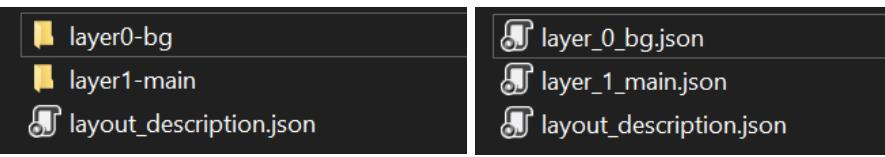

- **Subfolder**: the layer's folder must be located in layout folder, the **folder name must start** with "layer". The subfolder should contain a single json file with an unspecified name. Optionally, subfolders "vars", "components", "styles", "triggers" with corresponding json files can be created in the subfolder, which will be owned by the layer:
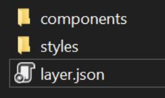

- **Json file**: the layer file must be located in layout folder and the **file name must start** with "layer":
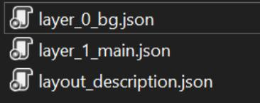

It can mix both the folder option and the file option.

Subfolder option: the **folder name** of the layer file **defines** the layer name. File option: the **file name** of the layer **defines** the layer name. The **rendering order** of layers, which is **very important**, **depends on the layer name**. Optimal working set:

- background layer
- main layer

First layer (which is supposed to be the background) has its own specific rendering behavior:

- If Width or Height for **BlockRoot** is not specified, it will automatically be set equal to the final image size.

- If Width or Height exceeds the final size of the image (the maximum size of the width and height of all other layers) then the layer size will be cut off.

- If Width or Height is less than the final image size (the maximum width and height of all the other layers), then the layer size will be rescaled.

An example of the contents of the layer:

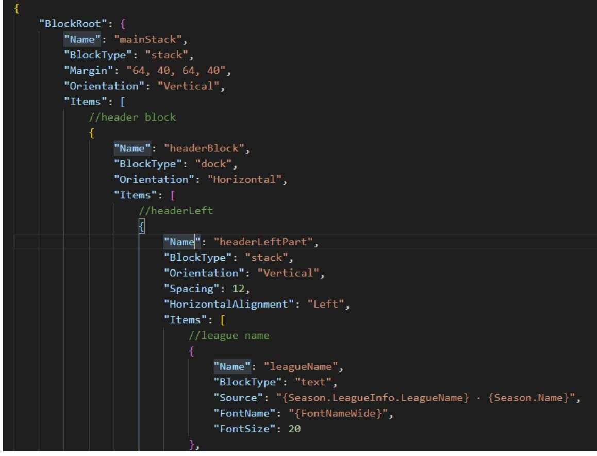

### **Asset inheritance**

The layer folder may contains the following folders:

- imagesfolder (optional).
- varsfolder (optional).
- componentsfolder (optional).
- stylesfolder (optional).
- triggersfolder (optional).

The same folders can also be located in the layout's root folder or in the theme's root folder. If the requested asset/component/style/image has the same name/file name at different levels (layer, layout or theme level), the resource will be searched first in the layer folder, then in the layout folder and only finally in the theme level. In this way it is possible to override the same resources at different levels. This also applies to component/style blocks defined inside the layer json file.

# **Logotypes**

Logotypes - are images that are automatically associated with various database objects. The agreement is used for this purpose.

| Caregory | Object type (renderer API) | Target Folder |
| --- | --- | --- |
| Nation | NationRenderData | / images / flags |
| Game | GameRenderData | / images / logotypes / games |
| Vendor | VendorRenderData | / vendors / images / logotypes |
| CarClass | CarClassRenderData | / images / logotypes / classes |
| Car | CarRenderData | / images / logotypes / cars |
| Team | TeamRenderData | / images / logotypes / teams |
| Track | TrackRenderData | / circuits / images / logotypes |
| Championship | ChampionshipRenderData | / images / logotypes / championships |
| Season | SeasonRenderData | / images / logotypes / seasons |
| Event | EventRenderData | / images / logotypes / events |
| Driver | DriverRenderData | / driver / images _avatars / |

When the app's UI or theme requires a logotype for a specific object, a rather complex algorithm is used, which is, however, quite flexible:

- - Any invalid characters (for the file system) in the name will be removed when searching for the logotype file.
- - 1.1. User folder + target folder. For example, "<app_root> / user / images / logotypes / teams /".
	- 1.2. Current theme's folder (the theme selected by the user in the app) + target folder. For example, "<app_root> / user / themes / my_custom_theme / images / logotypes / teams /". This means that **the theme can override the default logotypes**.
	- 1.3. Default logotypes. For example, "<app_root> / images / logotypes / teams /".
- 2. **The order of the paths matters**. The logo is first searched in folder 2.1, then 2.2, then 2.3. This applies to all file names. For example, if the current theme's folder contains "red bull" file, but not contains "red.bull.2023", then the logo from the default folder will be selected. This behavior can be changed using the property - UseFallbackSource (see below).
- 

- 3. The file is searched in the folder and in all subfolders. This means that the **folder hierarchy can be as complex as needed**. However, it is not allowed to have two files with the same name (no matter what the extension is), regardless of which subfolder they are located in.
### **Logotype variants**

The process of choosing a logo for a specific object, however, is more complex. Because there may be a situation when in some cases it is necessary to use one version of the same logo, and in other cases - a different one.

List of available variants:

- default
- alternative
- dark
- light
- grayed

A file appendix is used to separate logos by version: {filename)__{appendix).{extension}. For example, default version - "red_bull.png", alternative version – "red_bull__alternative.png", dark version – "red_bull__dark.png", etc. Note, it need use **two consecutive** underscores ( _ and _ ) to separate the name and the variant: : {filename)__{appendix).{extension}.

To control the search behavior for the desired logotypes, it need to use "LogotypeBehaviours" property in the theme_description.jsonfile.

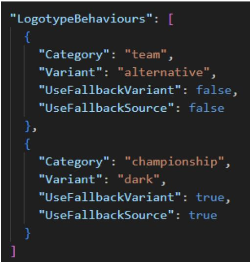

"LogotypeBehaviours" is a list of objects of type LogotypeBehaviour:

- Category : string logotype category (see table above).
- Variant : enum (default, alternative, dark, light, grayed) logotype variant for the specified category. Optional, default value - "default".
- UseFallbackVariant : bool whether to search for a default variant, in case the logotype of the required variant was not found. Optional, default value – "true".
- UseFallbackSource : bool whether to search for a logotype in the default folder if the required logo was not found in the theme folder. Optional, default value – "true".
- SetVariantByDefault : bool whether the specified variant should be used as the default variant (see below). Optional, default value – "false".

To get the path to a specific variant logo it can use NamedRenderObject properties (class of renderer data API, see manual's appendix):

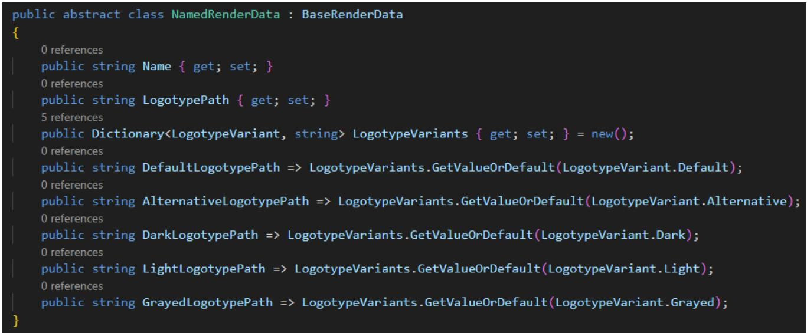

NamedRenderObject is a base class for objects that can have a name (TeamRenderData, DriverRenderData, etc). For example, to get dark variant of the logo for an object of type TeamRenderData, it can use the following expression:

# {Team.DarkLogotypePath}

**Important note**: for optimization purposes, by default the app does NOT search for and fills in different logo variants other than the default one. Therefore, the theme should explicitly set for each for logo's сategory a list of variant that the app should search for:

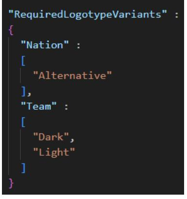

For this purpose, RequiredLogotypeVariants property of type Dictionary<logotype_category, List<logotype_variant>> is used in theme_description.json.

Unspecified by a specific variant LogotypePath property of NamedRenderObject normally returns the default variant. However, a theme can override this behavior by using the property SetVariantByDefault of LogotypeBehaviour.

For example, if theme_description.jsondefines it:

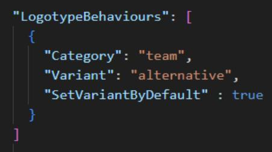

LogotypePath property (of TeamRenderDataobjects) will equals AlternativeLogotypePaths.

# **Liveries**

Liveries - are image files that are associated with either a specific team or a specific car.

The livery files must be located in one of these folder:

- <app_root> / images / liveries- default liveries
- <app_root> / user / images / liveries- user liveries
- <theme_folder> / images / liveries– theme's liveries

The internal folder hierarchy can be freely defined. The maximum priority is given to liveries retrieved from the theme folder. Only "png" images are supported.

The name of the livery file must fully match either the team unique ID or the car unique ID. For example, "red.bull.2023.png" or "bmw.m4gt3.png". However, additional livery variants for the same team/car are supported. To add additional variant, just put another livery file and name it using prefix:

{teamID}.{prefix}.png

For example, "red.bull.2023.**v2**.png". Further, on the line-ups page of the app, it possible to select a special livery variant for a specific driver.

Render data objects can automatically provide the path to the livery file. It supports TeamRenderData, CarRenderData, DriverSessionRenderData, DriverSeasonRenderData.

Note 1: for the app to support loading and displaying liveries in the UI, it must activate "Enable liveries support" option in the app's options (disabled by default).

Note 2: if the theme uses liveries somewhere in its code, it need to set ForceLiveriesLoading option to true in the theme_description.jsonfile

# **Block**

Rendering is based on a hierarchy of block objects. There are the following types of blocks:

- **stack** (container)
- **itemstack** (container)
- **dock** (container)
- **grid** (container)
- **table** (container)
- **canvas** (container)
- image
- text
- shape
- component
- style

Block-containers may include other blocks (in Items property for most). To create a markup, it need to describe the blocks and their properties.

The layer always starts with a description of the **BlockRoot**:

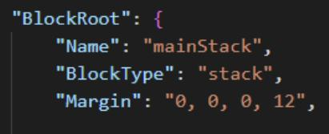

## **Block properties**

The usual json properties are used to describe the block. The following is a specification of the properties of the blocks.

For example, this

means that it describe Opacity property and set its value as a number between 0 and 100:

Data types

| name |  | description | example |
| --- | --- | --- | --- |
| string |  | string value | "text" |
| int |  | number | 10 |
| bool |  | boolean value (true, false) | false |
| color |  | color value (see further) | "#FF15AB18" |
| List< object | > | array of objects of type object | [ { BlockType : "image" }, |

|  |  | {BlockType : "text" } ] |
| --- | --- | --- |
| Dictionary<string, object> | key-value array | "Key1" : "Value1", "Key2" : "Value2 |
| object | bool universal type (can be string , , |  |
| int | , etc) |  |

#### **Common properties for any type of block**

- BlockType (required)
- Name : string
- RenderIf : bool
- RenderForce : bool
- Opacity : int (0-100)
- Width : int width in pixels, support string values ("*", "auto")
- Height : int height in pixels, support string values ("*", "auto")
- MinWidth : int
- MinHeight : int
- MaxWidth : int
- MaxHeight : int
- WidthPercent : int (0-100) determines the percentage of the width of the parent block's available space. A value of 100 is equivalent to setting StretchWidth to true
- HeightPercent: int (0-100) determines the percentage of the height of the parent block's available space. A value of 100 is equivalent to setting StretchHeight to true
- StretchWidth : bool indicates whether all available space should be filled (by width)
- StretchHeight : bool indicates whether all available space should be filled (by height)
- HorizontalAlignment : (Left, Right, Center)
- VerticalAlignment : (Top, Center, Bottom)
- Margin : string (single value ("4") margin 4 pixels for all sides, two values ("4, 8") margin 4 pixels for left and right side, 8 pixels for top and bottom side, fourth values ("4, 8, 12, 16") – margin for left, top, right, bottom side accordingly
- MarginLeft, MarginTop, MarginRight, MarginBottom : int
- Padding, PaddingLeft, PaddingTop, PaddingRight, PaddingBottom similarly margin
- Background : color
- BackgroundImage : string path to image to be used as block background
- UseBackgroundCrop : bool whether background image should be cropped
- BackgroundImageOpacity : int (0-100)
- GridRow : int row number if block is child for grid
- GridCol : int column number if block is child for grid
- PositionX : int x position if block is child for canvas
- PositionY : int y position if block is child for canvas
- Colorize : ColorizeOptions colorize the final block image using by specific color
- ColorizeBackground : ColorizeOptions colorize background of the block using by specific color
- Triggers : List<TriggerItem> triggers for properties
- Source : object data source (text, image or collection path)
- Vars: Dictionary<string, object>. Defines local block variables. Hierarchically inherited by all underlying blocks. Overrides all higher-level variables (global and local parent block variables by hierarchy)
- Items : List<Block> array of nested blocks (available for block-containers)
- FontName : string (only text block) automatically substituted into TextOptions. Convenient way to determine the font name.
- FontSize * : string (only text block) automatically substituted into TextOptions.
- Foreground : color (only text block) automatically substituted into TextOptions.
- Orientation * : (Horizontal, Vertical) available for stack, dock, itemstack.
- Spacing * : int free space between nested blocks, available for stack, dock, itemstack.
- Components : List<Block> defines components available for all nested blocks, including down the hierarchy.
- Styles : List<Block> defines styles available for all nested blocks, including down the hierarchy.

Items applies to the following blocks: stack, dock, grid, canvas.

For convenience, the most common properties (FontName, Orientation, etc) that are located in block options are placed in the block itself too. You can use them both ways, but the block properties have higher priority than the option properties.

Source duplicates specific properties for blocks (ImagePath, Text, etc). Also has a higher priority.

Width and Height are 0 by default. This means that the engine will automatically calculate the width or height of the block depending on the content. In case you want to try to fill all the available space, you can specify the symbol "*" instead of a numeric value.

An example of a description of a simple block:

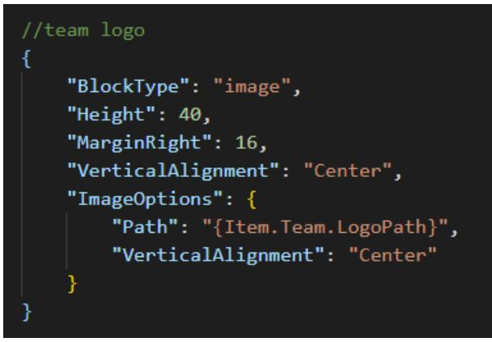

**Layer** can contain only **one** root block. It must be specified as an object for the "**BlockRoot**" property:

| 2 | "BlockRoot": { |
| --- | --- |
| з | "Name": "mainStack", |
|  | "BlockType": "stack", |
| 4 | "Margin": "64, 40, 64, 40", |
| б | "Orientation": "Vertical", |
| 7 | "Items": [ //header block |
| 9 |  |
| 10 | "Name": "headerBlock", |
| 11 | "BlockType": "dock", |
| 12 | "Orientation": "Horizontal", |
| 13 | "Items": [ |

It is recommended to choose **stack**, **dock** or **grid** as the root block.

# **Block Types and Block Options**

Individual properties that are required for a specific type of block are placed in separate objects - **block options**. You can see it in the screenshots above ("ImageOptions"). It is **not** always necessary to specify this object. The following are properties for specific block options.

### **Image**

#### BlockType: image BlockOptions: ImageOptions

Used to display an image.

- Path : string
- DefaultPath : string
- HorizontalAlignment : (Left, Center, Right)
- VerticalAlignment : (Top, Center, Bottom)
- Opacity : int

Path property (also can be use Source property of the block) specifies either the data object or the path to the image file (.png, .jpg, .jpeg). There are three options for specifying a path:

- Absolute path ("C:\MyPictures\picture.png"). Removed in 0.9.5.
- Related path ("separators/separator_red.png") - need to specify the full path to the file, including the extension, relative to "images" folder located in the root of the theme (or layout/layer).

Only filename ("picture"), also can be without the file extension – the file with this name is searched for in %mod_folder% first, then %theme_default% (including all subfolders). If no file extension was specified, the png and jpg extensions are automatically substituted. Removed in 0.9.5.

DefaultPath is used in case it failed to retrieve an image from the Path property.

### **Text**

BlockType: text BlockOptions: TextOptions

Used to display a text.

- Text : string
- FontName : string, if empty use value of the global variable "FontNameDefault"
- FontSize : int, if empty use value of the global variable "FontSizeDefault"
- FontStyle : (Regular, Bold, Italic, BoldItalic) might not work yet
- Foreground : color, if empty use value of the global variable "ForegroundDefault"
- TextAlignment : (Start, End, Center) might not work yet
- HorizontalAlignment : (Left, Center, Right)
- VerticalAlignment : (Top, Center, Bottom)
- LineSpacing : int
- Wrap : bool might not work yet
- ColorizeRating : ColorizeRatingOptions set the foreground color depending on the rating value:

# **ColorizeRatingOptions**

- IsEnabled : bool
- Level : int (0-100) this value will determine the color
- GradientStops : List<GradientStop> gradientstop list for the custom color assignment algorithm. If this property is not specified, the default values are used.

# **GradientStop**

- Color : color
- Offset : int (0-100)

To make the text wrap, it may need to force the width of the text block. Dev in progress.

### **Stack and Dock**

#### BlockTypes: stack and dock BlockOptions: PanelOptions

Container-block, which to locate one or more nested blocks. Stack arrange nested (inner) blocks sequentially, one by one:

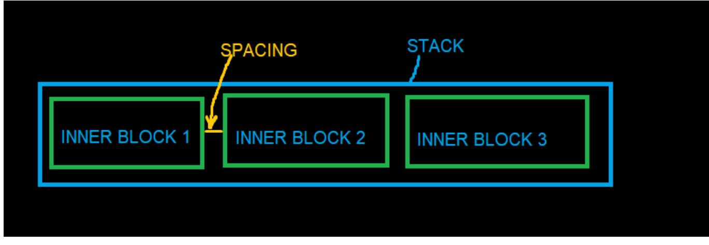

Dock is the same stack, except:

- By default it fills all available space (StretchWidth or StretchHeight is **true**, depending on the Orientation value)
- If inner block or blocks specify a horizontal (or vertical) alignment, dock uses this to dock to sides of the block accordingly:

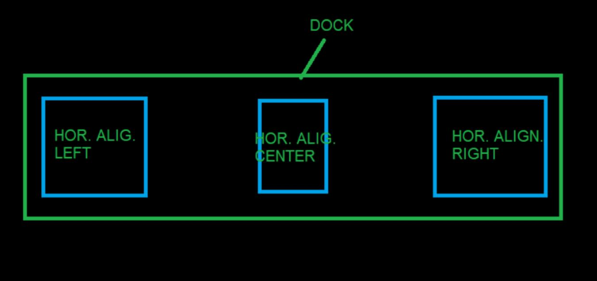

Only one inner block can specify center alignment (horizontal or vertical).

- Orientation : (Horizontal, Vertical)
- HorizontalDirection: (LeftToRight, RightToLeft)
- VerticalDirection: (TopToBottom, BottomToTop)
- Spacing : int spacing in pixels between inner blocks

## **ItemStack**

BlockType: itemstack BlockOptions: ItemStackOptions and PanelOptions

Itemstack is the same stack, but inner blocks are generated automatically based on the collection from the data. Items property is ignored.

- ItemSource : string, data access expression (only for collection/list)
- ItemTemplate: block template for each inner blocks
- SortMember: string, can be data access expression item's property name for sorting collection
- OrderBy, OrderBy2, OrderBy3, OrderByDescending, OrderByDescending2, OrderByDescending3 : string, can be data access expression – item's property name for sorting collection
- FilterMember : string, can be data access expression item's property name for filtering collection
- FilterMemberValue : string value of the property by which the collection will be filtered
- Reverse : bool whether the collection elements should be reversed
- Limit : int limiting the number of items in the collection
- IndexStart: int starting index of the collection
- IndexEnd: int, ending index of the collection
- TakeItemIndex : int required index of the collection (will be consist only of one item by specified index)
- TakeItemsFirst : int specifies the number of the first items of the collection to be included
- TakeItemsLast : int specifies the number of the last items of the collection to be included
- CollectionPart : string specify the part of the collection to be used (for example: "1/3" will be used only first third of the collection, "3/3" - will be used only last third of the collection)

## **Grid**

# BlockType: grid BlockOptions: GridOptions

Container for arrangement of inner blocks in the form of a grid:

| ROW 0 COL 0 | ROW 0 COL 1 |  |
| --- | --- | --- |
| ROW 1 COL 0 | ROW 1 COL 1 | ROW 1 COL 2 |
|  | ROW 2 COL 1 GRID |  |

Grid automatically calculates column widths and row heights based on the dimensions of the inner blocks. To specify in which column or which row the block should be placed, it need to

specify the GridCol and GridRow properties respectively. Only one block can be placed in one cell.

- Rows : List<GridRowDefinition>
- Cols: List<GridColDefinition>

# **GridRowDefinition**

- Height : int height of the specific row
- IsStretchHeight: bool indicates whether all available space should be filled (by height), only one row can be set to true.

## **GridColDefinition**

- Width : int width of the specific column
- IsStretchWidth: bool indicates whether all available space should be filled (by width), only one column can be set to true.

### **Canvas**

#### BlockType: canvas BlockOptions: CanvasOptions

A container that arranges inner blocks in an manually way. Each inner block must define PositionX and PositionY to indicate its leftmost coordinate. CanvasOptions currently not contains any properties.

## **Table**

#### BlockType: table BlockOptions: TableOptions

Generates blocks as a table based on the collection/list. Items property is **not** used.

- ItemsSource : string, data access expression (only for collection/list)
- HeaderTemplate : block template for table headers (located above each column)
- HeaderHeight : int
- RowHeight : int
- RowCount : int
- ColSpacing : int
- RowSpacing : int
- SeparatorSpace : int additional space if column is separator
- GroupSpaceReduction : int space reduction between columns same groupID
- SortMember: string, can be data access expression item's property name for sorting collection
- OrderBy, OrderBy2, OrderBy3, OrderByDescending, OrderByDescending2, OrderByDescending3 : string, can be data access expression – item's property name for sorting collection
- FilterMember : string, can be data access expression item's property name for filtering collection
- FilterMemberValue : string value of the property by which the collection will be filtered
- Reverse : bool whether the collection elements should be reversed
- Limit : int limiting the number of items in the collection
- IndexStart: int starting index of the collection
- IndexEnd: int ending index of the collection
- TakeItemIndex : int required index of the collection (will be consist only of one item by specified index)
- TakeItemsFirst : int specifies the number of the first items of the collection to be included
- TakeItemsLast : int specifies the number of the last items of the collection to be included
- CollectionPart : string specify the part of the collection to be used (for example: "1/3" will be used only first third of the collection, "3/3" - will be used only last third of the collection)
- Columns : List<TableColumnDefinition>

# **TableColumnDefinition**

- Width : int width of the specific column
- MarginLeft : int
- MarginRight : int
- IsStretchWidth: bool indicates whether all available space should be filled (by width), only one column can be set to true
- Header : string text for header template (will be replace text property of any text block of header template)
- RenderIf : bool
- Template : block template for each item of column
- IsSeparator : bool indicates whether the column is a separator
- GroupId : int same group Id (>0) can be set for several column to bring them closer to each other in the column space
- MultiColumnHeadersSource : string data access expression (only for collection/list) for multicolumn headers
- MultiColumnItemsSource : string data access expression (only for collection/list) for multicolumn items
- MultiColumnHeaderTemplate : block template for each item of multicolumns

Multicolumn- a special feauture for expanding one column into multiple columns:

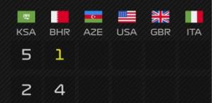

### **Shape**

BlockType: shape BlockOptions: ShapeOptions

Displays a simple figure.

- ShapeType : (rectangle, ellipse) ellipse currently not works properly
- Fill : color

### **Component**

BlockType: component BlockOptions: ComponentOptions

This block is used to reuse complex blocks in different places in a layer or different layouts. See Components.

- Vars: Dictionary<string, object>
### **ColorizeOptions**

### BlockOptions: ColorizeOptions

Specific option object to describe how the background or the final image of the block should be colored.

- Enabled : bool
- Color: color
- BlendPercentage: int (0-100)
- AlphaCompositionMode: (SrcOver, Src, SrcAtop, SrcIn, SrcOut, Dest, DestAtop, DestOver, DestIn, DestOut, Clear, Xor). Can be empty/null. Default value: (SrcATop)
- ColorBlendingMode: (Normal, Multiply, Add, Subtract, Screen, Darken, Lighten, Overlay, HardLight). Can be empty/null. Default value: (Screen).

# **Components**

Components are designed to reuse the same block in different places, different layers or layouts. Fundamentally**,** a **component is a block**. A component can have any type of block (text, image, table, etc) and any complex internal block hierarchy if the root block is block-container.

The moment the code references a component, the renderer first looks for that component in the resources, and then copies it in its entirety and substitutes it in the caller place.

There are several options as to where the component can be located:

#### **1. "components" folder (at the theme, layout or layer level).**

Any custom internal folder hierarchy is allowed. There are two formats of json files describing components:

- One file (.json) one component:

```
{ "ComponentName": "MainHeader", "BlockType" : "text" }
```
- One file (.json) many components:

```
[ { "ComponentName" : "MainHeader", "BlockType" : "text", … },
```

```
{ "ComponentName" : "Footer", "BlockType" : "stack", … } ]
```
In the first case, the component block itself is used as the json root (single populated component). In the second case, the root of the json file is an array of blocks.

There are two ways to refer to a specific component:

- Specify component name (specified in the "ComponentName" property):

```
{ "BlockType" : "component", "Component" : "Footer" }
```
- Specify the relative file path and file name (without extension), requires the file to have a single populated component:
	- { "BlockType" : "component", "Component" : "/headers/mainHeader" }

For the second way it is necessary to put the slash in the beginning.

# **2. Directly in layer's code**

Block-containers (stack, dock, itemstack, canvas, table) have Components property. This property allows to define an array of components that will be available to all childs and so on down the hierarchy.

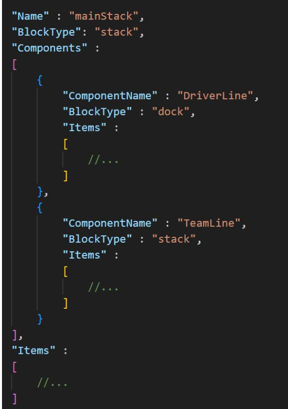

### **Component properties**

- ComponentName : string, (required)
A prerequisite is that ComponentName property of the root block is defined. If it is a single populated component and all other code references only using the file path, this requirement can be skipped.

#### *С***omponent usage**

To use a component, it need to define a block with component type and specify the component's name (or path to the component's json file without extension, using "/" in the beginning of the path) in Component property:

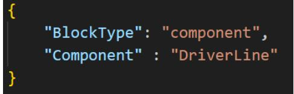

### **Finding the required component**

When the renderer encounters a block of type component, and if no component file path is specified as the component name, the search order is as follows:

- 1. The parent block is found and the presence of the required component is checked in Components property.
- 2. If the required component is not found, Components property of the parent block of the current parent block is checked.
- 3. If the process ends with BlockRoot, the renderer accesses external files.
- 4. If the layer file is defined in a separate folder, the required component is searched in %layer_folder% / components /subfolder.
- 5. Next, the component is searched for in %layout_folder% / components /folder.
- 6. And at the end the component is searched for in the %theme_folder% / *с*omponents /
- 7. If the component is not found, the renderer will generate an error.

#### **Component variables**

Each component can define its own variables. To define a variable, it need to specify the following in the value of the desired property, using angle brackets (within the component/component hierarchy):

```
"<component_variable_name>"
```
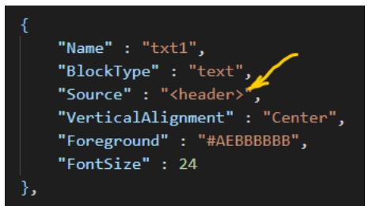

In this example, "header" is a component's variable. Then, the moment the component is used in code, it possible to define the values of the component's variables using Vars property inside ComponentOptions property:

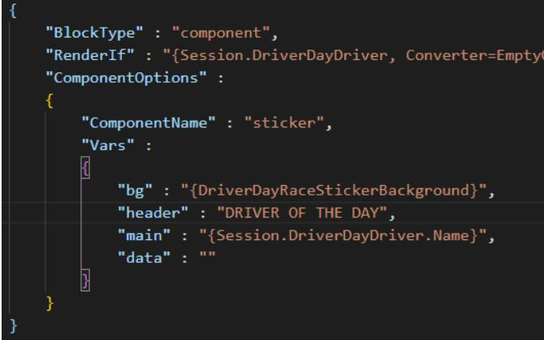

In the example, <header> will be replaced with the string "DRIVER OF THE DAY". • Vars: Dictionary<string, object>

The general rule for replacing component variables is as follows: any text (inside of component) placed in angle brackets ("<", ">") is subject to replacement, according to the variables declared in ComponentOptions. The variable name must completely match the text inside the brackets.

However, in case you need to use expressions in a component, but the data object is not known at the component's context, you can use the following trick:

```
Component: <{data_object.Value}>
```

```
Component's variable, declared in Vars: "data_object" : "Item"
```
The **dot** inside the **expression**, which in turn is between angle brackets changes the principle of variable substitution. The renderer will only change the left side (relative to the point) of the expression:

```
<{data_object.Value}> -> {Item.Value}
```
Example:

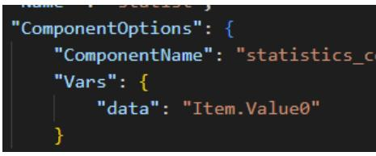

Component:

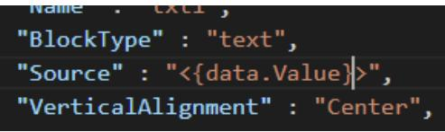

The renderer will replace the variable (**data** in this example) with the part of the expression that was declared in Vars: **Item.Value0**. Final expression will be: **{Item.Value0.Value}**

That is, the expression will be combined in two parts, with the left part declared in the place where the component is invoked and the right part declared in the component itself.

# **Styles**

In cases where it is necessary to apply the same set of properties to different blocks, styles can come in handy. Fundamentally**,** a **style is a block**. It can be of any block type, it has no effect, but it can contain any of nested *Options (TextOptions, ImageOptions, etc). The block type as well as Items property are ignored.

The moment the code references a style, the renderer first looks for that style in the resources, and then **applies all the style property values to the block** that requests the style. The values of properties directly defined in the block have a higher priority than style properties.

There are several options as to where the styles can be located:

#### **1. "styles" folder (at the theme, layout or layer level).**

Any custom internal folder hierarchy is allowed. There are two formats of json files describing styles:

- One file (.json) one style:

```
{ "StyleName": "RegularTextStyle", "BlockType" : "text", … }
```
- One file (.json) many styles:

```
[ { "StyleName" : "TableHeaderStyle", "BlockType" : "text", … },
```

```
{ "StyleName" : "DriverAvatarStyle", "BlockType" : "image", … } ]
```
In the first case, the style block itself is used as the json root (single populated style). In the second case, the root of the json file is an array of blocks.

There are two ways to refer to a specific style:

- Specify style name (specified in the "StyleName" property):
	- { "BlockType" : "image", "Style" : "DriverAvatarStyle", … }
- Specify the relative file path and file name (without extension), requires the file to have a single populated style:

```
{ "BlockType" : "text", "Style" : "/textStyles/regularTextStyle", … 
}
```
For the second way it is necessary to put the slash in the beginning.

# **2. Directly in layer's code**

Block-containers (stack, dock, itemstack, canvas, table) have Styles property. This property allows to define an array of styles that will be available to all childs and so on down the hierarchy.

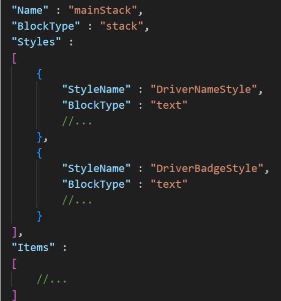

#### **Style properties**

- StyleName : string, required.
- StyleBasedOn : string, optional.

A prerequisite is that StyleName property of the block is defined. If it is a single populated style and all other code references only using the file path, this requirement can be skipped.

## **Styles hierarchy**

It is possible to have a complex hierarchy of styles. For example, style A can be the parent of styles B and C. All children inherit all values of their parent's properties, but can override any of them or define the value of a new property. In order to specify a parent, a style must specify the parent style name (or path to it) using StyleBasedOn property. The parent style must be defined higher up in the style search hierarchy.

#### *Style* **usage**

To use a style it need to specify the name/path of the style in Style property. All block types have this property.:

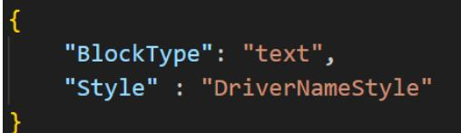

## **Finding the required style**

See Finding the required component, the process is completely similar.

# **Triggers**

Triggers are used to change the value of block properties or block options properties under certain conditions. Each block may include a set of triggers (TriggerItem):

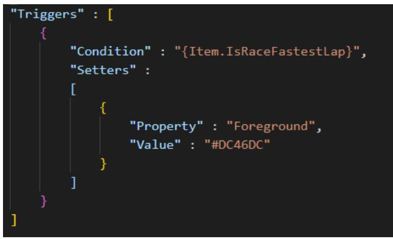

# **TriggerItem**

- Condition : <any value> (required) condition under which the trigger will be used. If "ConditionValue" is not set: it is assumed that "bool" value is used (can be "number" type, 0 = false, >0 = true). If "ConditionValue" is set, "Conditon" can be any type/value (it will be forcibly converted to string type during comparison).
- ConditionValue : <any value> is used to set the value at which trigger condition will be true. For example, if "Condition" is 25, and "ConditionValue" is "25", both values will be forcibly converter to string, and final trigger condition will be true.
- ConditionAnd : <any value> additional condition (implement AND logic). If "ConditionAndValue" is not set: it is assumed that "bool" value is used (can be "number" type, 0 = false, >0 = true). If "ConditionAndValue" is set, "ConditonAnd" can be any type/value (it will be forcibly converted to string type during comparison).
- ConditionAndValue : <any value> -similarly to "ConditionValue".
- ConditionOr : <any value> additional condition (implement OR logic). If "ConditionOrValue" is not set: it is assumed that "bool" value is used (can be "number" type, 0 = false, >0 = true). If "ConditionOrValue" is set, "ConditonOr" can be any type/value (it will be forcibly converted to string type during comparison).
- ConditionOrValue : <any value> -similarly to "ConditionValue".
- Setters : List<TriggerPropertyItem>
- TriggerName : string used to define the name of external trigger.
- Trigger : string specifies the name of the external trigger.

# **TriggerPropertyItem**

- Property : string (optional) full path to block's property name ("Foreground" or "TextOptions.Foreground" as example)
- Var : string (optional) name of block's variable. Used to allow a trigger to override a block's variable. If a block does not have a defined variable with this name, it will be automatically added to the block's variables.
- ComponentVar : string (optional) name of component's variable. Used to allow a trigger to override a component's variable. If a block does not have a defined component variable with this name, it will be automatically added to the component's variables.
- Value: object value of property/var/component's var. Can be object of ("*Options", such as ImageOptions, TextOptions, etc) or ColorizeOptions. Overrides the current value of the property/var/component's var.

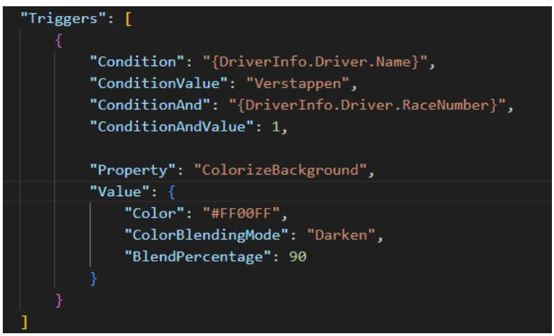

TriggerPropertyItem is used primarily for overriding block properties. However, if necessary, it can be used to override a variable or component variable (in the context of the block). To do this, it need to define Var or ComponentVar property (instead Property). Value will be used as value for overrides as well as for property or var/component var.

For convenience, if it need to override only one property, it can leave TriggerPropertyItem list are empty and specify Property (or Var or ComponentVar) and Value immediately in the trigger:

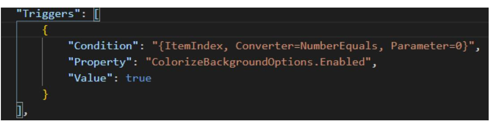

# *External triggers*

Similar to components and styles, it is possible to define a trigger in external files and then reference external triggers by their name or file path. This allows to reuse the same trigger in different places.

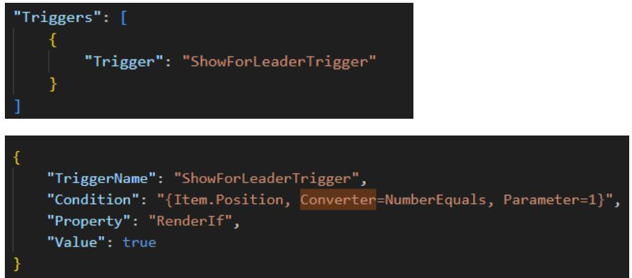

The moment the code references a trigger, the renderer first looks for that trigger in the resources, and then copies it in its entirety and substitutes it in the caller place.

External trigger can be located into "Triggers"folder (at the theme, layout or layer level). Any custom internal folder hierarchy is allowed. There are two formats of json files describing triggers:

- One file (.json) one component:

```
{ "TriggerName": "ShowLapsTrigger", "Condition" : … }
```
- One file (.json) many components:

```
[ { "TriggerName" : "ShowLapsTrigger", "Condition" : … },
```

```
{ "TriggerName" : "ShowWeatherTrigger", "Condition" : … } ]
```
In the first case, the trigger (TriggerItem) itself is used as the json root. In the second case, the root of the json file is an array of trigger (TriggerItem).

There are tw o ways to refer to a specific trigger:

- Specify component name (specified in the "ComponentName" property):

```
{ "Trigger" : "ShowLapsTrigger" }
```
- Specify the relative file path and file name (without extension), requires the file to have a single trigger:

```
{ "Trigger" :"/headerTriggers/ShowLapsTrigger" }
```
For the second way it is necessary to put the slash in the beginning.

# **Color**

The format of the value for a variable of type color:

Color : "#FF010203"

Where:

- # not required
- FF hex value for opacity (not required)
- 01 hex value for red color component
- 02 hex value for green color component
- 03 hex value for blue color component

Examples: "#D0A0C0", "D0A0C0"

Another option – numeric format (0-255), RGB or ARGB:

Color : "255,0,0" Color : "200, 10, 15, 20"

# **Variables**

Variables (vars) are a list of the "name" - "value" type (Dictionary<string, object>) :

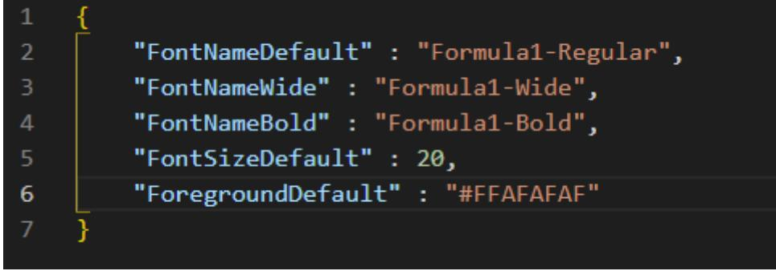

They can be defined (upwardly prioritized) :

- %theme_folder% / globals / global_vars.json(lowest priority)
- %theme_folder% / vars /
- %layout_folder% / vars /
- %layer_folder% / vars /
- localization vars
- public properties/vars
- inside block's Vars property (max priority)

If vars are defined in a separate file, the json root should be a json object with key-value pairs. File names inside vars of folders, internal folder hierarchy does not matter, what matters is the variable name. It is not allowed to have variables with the same name at the same level.

Similar to components/styles, each level can override the value of the same variable. The immediate parent block variables has the highest priority, global_vars.jsonhas the lowest.

Expressions are used to access the value of a variable:

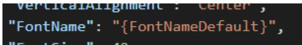

Variable names cannot contain spaces or the dot character.

# **Public properties**

Public properties are designed to allow the end user, using a user-friendly UI, to modify the behavior of the theme. In the end, any custom property is turned into a variable that has a name and a value.

| Theme properties |  |  |  |  |
| --- | --- | --- | --- | --- |
| Presets: | preset 1 |  |  | Apply preset |
| ^ F1 only |  |  |  |  |
| Use F1 fonts |  |  |  |  |
| Pre-header for session: ① |  |  | default_value |  |
| Post-header for session: |  |  |  |  |
| Driver name font size: |  | 30 |  |  |
| Render results width: | 0 |  |  |  |
| Table size: ① | Medium |  |  |  |
| F2 only |  |  |  |  |

To define public properties, it need to create **public_properties.json** file in %theme_folder% / globals /folder:

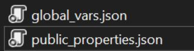

Example:

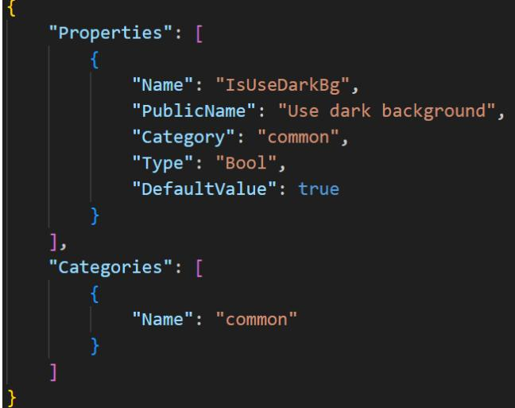

## **public_properties.json**

- Properties : List<PublicProperty>
- Categories : List<PublicPropertiesCategory> optional
- Presets : List<PublicPropertiesPreset> optional

## **PublicProperty**

- Name : string var's name. Required.
- PublicName : string displayed name in the UI. Required.
- Type : (Bool, Integer, String, Float, Enum) variable type.
- DefaultValue : object.
- Description : string.
- Category : string determines whether a variable belongs to a specific category. Optional.
- MinimumValue : int minimum value for integer, float types. Restricts the user input.
- MaximumValue : int minimum value for integer, float types. Restricts the user input.
- EnumValues : List<string> see Enum properties.

# **PublicPropertiesCategory**

- Name : string any valid string, spaces are allowed. Only affects the UI, not the renderer.
- Order : int determines the order in which categories are displayed in the app's UI. Optional.

# **PublicPropertiesPreset**

- Name : string Preset name, spaces are allowed. Only affects the UI, not the renderer.
- DefinedProperties : Dictionary<string, object>

## **Enum properties**

If it is required that the user can select string value from a predefined list of values, properties of type **enum** (Enum) are used:

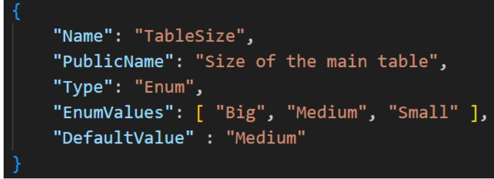

In the end, a public property variable of type enum will contain string.

## **Categories**

Categories are used to group a specific set of properties. Use property Category of PublicProperty object to map. If a property is not mapped to any category, it will be displayed at the beginning of the property list.

## **Presets**

With presets, the end user can quickly define the values of several properties at once. To define a preset, add it to Presets collection, give it a name and set values for the required properties, using DefinedProperties array of key-value pairs:

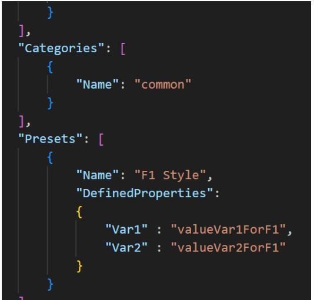

# **Expressions**

Expressions are used to access data and variables. Most properties (enumerations, like HorizontalAlignment, also support expressions) can use expressions in their value.

The expression is a string enclosed in curly braces: "{expression}":

## **Data source**

The data source for expressions can be:

- **Data objects** (see below).
- **Variables** (see Variables).
- **Public properties** (see Public properties).
- **Localization vars** (see Localization support).
- Сurrent block's context ("**Item**", "**ItemIndex**", "**ColumnIndex**")

### **Data objects**

Data objects are described in the data objects API (see Appendix).

Each render type provides its own set of root data objects:

- RaceResults, QualResults, CombinedQualResults : "Session", "Event"
- DriverStandings, TeamStandings : "Standings"
- Lineups, LineupsReserve : "Lineups"
- Calendar : "Events"
- DriverSessionStatistics:"Statistics", "Session", "Event"
- DriverSeasonStatistics: "Statistics"
- DriverSession: "DriverInfo", "Session", "Event"
- DriverInfo: "DriverInfo"
- PenaltyItem: "Penalty"
- PenaltyItems: "Penalties"
- PenaltySeasonStatistics:"Penalties"

Mapping root objects to data API classes

| Name of the root data object | Name of the class in API (see appendix) |
| --- | --- |
| "LayoutInfo" | LayoutInfo |
| "Season" | SeasonRenderData |
| "Session" | SessionRenderData |
| "Standings" | StandingsSeasonRenderData |

| "Events" | EventsSeasonRenderData |
| --- | --- |
| "Event" | EventRenderData |
| "Lineups" | LineupsSeasonRenderData |
| "Statistics" | StatisticsRenderHost |
| "DriverInfo" | (DriverSession) -> |
|  | DriverSessionRenderHost |
|  | (DriverInfo) -> |
|  | DriverRenderHost |
| "Penalty" | PenaltyItemRenderData |
| "Penalties" | (PenaltyItems) -> |
|  | EventPenaltiesRenderHost |
|  | (PenaltySeasonStatistics) -> |
|  | SeasonPenaltiesRenderHost |

"LayoutInfo" and "Season" data objects is available in **all** render types.

Some of render objects also contains "Name" and "LogoPath" properties (can be null). This can be defined in case the corresponding class inherits from NamedRenderData.

The full path to the property is used to access the value:

# "{Session.DriverDayDriver.Name}"

If the expression does not contain a dot, the app tries to find a variable with that name.

For inner blocks of those blocks that use collections (itemstack, table), the following objects can be specified as the root object:

- "Item" access to the current item of the data collection/list
- "ItemIndex" : int index of the current item (starts with 0)
- "ColumnIndex" : int index of the current column (starts with 0, only for table)

Complex or mismatched types will be converted to string type. It can refer to objects of type byte[] as a path to images (for images that are stored in the database).

Example of the expression:

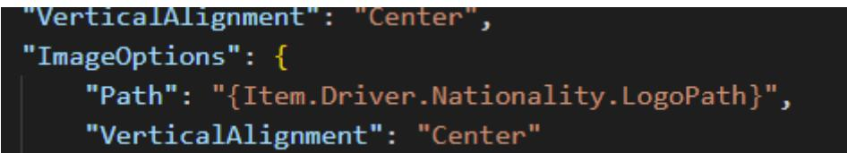

### **Return value of expressions**

Depending on the context, an expression can return either an object (bool, number, color, etc) or a string. When the context requires a string from an expression, but the expression returns an object, the object will be forced to string.

If an expression is used to define the value of a block property that requires an object of a specific type (for example, PaddingLeft requires number), there can be only one expression at the root:

Correct:

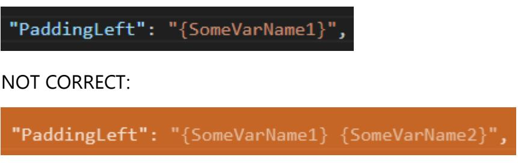

However, if the property requires a string, you can combine expressions however you like.

#### *С***ombining expressions**

It is allowed to enclose expressions in each other, to use an expression as the name of a converter or a converter parameter. The number of enclosures is unlimited. This also applies to localization string substitutions

For block properties that require a string, it can use multiple expressions on one string or combine an expression with literals:

### **Escaping special symbols**

In order to use some characters as literals rather than control characters, you must escape them:

| Symbol | Escaping symbol |
| --- | --- |
| { | //{ |
| } | //{ |
| [ | //[ |
| ] | //] |
| < | //< |
| > | //> |
| = (inside of expression) | //= |
| : (inside of converter's parameters part) | //: |

|
|  |

Example:

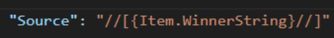

This expression will be convertered to :

"[driver_name]"

Note: the choice of forward slash instead of backslash is to avoid problems with the json parser, and the need to double slash is to avoid potential problems with the use of URIs and file paths.

# **Data Converters**

Using an expression, it can possible specify a data-converter to convert the data. To do this, add a comma and the word "**Converter**" after the main expression, and then specify the name of the converter after the "**=**" character. Example:

### **Parameters**

It is also possible to pass a parameter to the converter. To do this, it need to add

```
"Parameter={parameterValue}"
```
with the value after the converter name (a comma must be added after the converter name):

Some converters require more than one parameter. To pass them, use

"Parameters={parameterName1}:{parameterValue1};{parameterName2}:{pa rameterValue2}"

The order of the parameters is not important.

#### *С***onverters (with one parameter or without parameters):**

| Converter name | Description | Parameter | Example |
| --- | --- | --- | --- |
|  |  | type |  |
| StringToLowerString |  |  | "ABC" -> "abc" |
| StringToUpperString |  |  | "abc" -> "ABC" |
| StringEquals | string comparison | string | "str1", "str1" -> true |
| StringNotEquals | string comparison | string | "str1" , "str1" -> false |
| EmptyObjectToFalse | converting null or empty |  | '' -> false |
|  | value to bool |  |  |
| EmptyObjectToTrue | converting null or empty |  | '' -> true |
|  | value to bool |  |  |
| BoolReverse |  |  | true => false |
| NumberZeroToEmpty |  |  | 0 => '' |
| NumberEquals | number comparison | int (number) | 0, 5 -> false |
| NumberNotEquals | number comparison | int (number) | 0, 5 -> true |
| NumberGreater | number comparison | int (number) | 0, 5 -> false |
| NumberLess | number comparison | int (number) | 0, 5 -> true |

| NumberAbs | absolute value of the |  | -10 -> 10 |
| --- | --- | --- | --- |
|  | number |  |  |
| NumberAdd | add parameter to value | int (number) | 5, 2 -> 7 |
| NumberSubtract | subtract parameter from | int (number) | 5, 2 -> 3 |
|  | value |  |  |
| NumberMultiply | value and parameter | int (number) | 5, 2 -> 10 |
|  | multiplication |  |  |
| NumberDivide | dividing a value by a | int (number) | 5, 2 -> 3 |
|  | parameter |  |  |
| DateToDayOfMonth | day number of the date | string | date(01.12.2022) -> 1 |
|  |  | (locale*), |  |
|  |  | optional |  |
| DateToMonth | month number of the | string | date (01.12.2022) -> 12 |
|  | date | (locale*), |  |
|  |  | optional |  |
| DateToMonthInWords | month of the date | string | date (01.12.2022) -> |
|  |  | (locale*), | "december" |
|  |  | optional | date(01.12.2022), "es_ES" - |
|  |  |  | > "diciembre" |
| DateToYear | year of the date | string | date(01.12.2022) -> 2022 |
|  |  | (locale*), |  |
|  |  | optional |  |
| DateToTime | time of the date | string | date (01.12.2022 0:00:00) - |
|  |  | (locale*), | > "0:00" |
|  |  | optional |  |
| TemperatureCelciusTo | convert temperature |  |  |
| Fahrenheit | from Celcius to |  |  |
|  | Fahrenheit value |  |  |
| NumberGroupWithSep | separates groups of | string | 5500 -> 5.500 |
| arator | digits with a custom |  |  |
|  | character |  |  |
| EnumEquals | compares the | string |  |
|  | enumeration value with |  |  |
|  | a string |  |  |
| StringAdd | adds another string to | string |  |
|  | the string |  |  |
| StringFormat | substitutes the | string | '202SUB', '2' -> '2022' |
|  | parameter- string in a |  |  |
|  | special place of the |  |  |
|  | original string (instead |  |  |
|  | "SUB") |  |  |
| StringFormatReverse | substitutes the original | string | '2', '202SUB' -> '2022' |
|  | string in a special place |  |  |
|  | of the parameter-string |  |  |
|  | (instead "SUB") |  |  |

| PercentOf | calculates the | int | 10, 100 -> 10 |
| --- | --- | --- | --- |
|  | percentage. The initial |  |  |
|  | value from which the |  |  |
|  | percentage is calculated |  |  |
|  | serves as the parameter |  |  |
| PercentTo | calculates the | int | 100, 10 -> 10 |
|  | percentage. The initial |  |  |
|  | value from which the |  |  |
|  | percentage is calculated |  |  |
|  | serves as the original |  |  |
|  | value |  |  |
| NumberIsEven |  |  | 1 -> false |
| NumberIsOdd |  |  | 1 -> true |
| TruncateString | Truncate string to a | int | "Long string", 5 -> |
|  | certain length, adding |  | "Long…" |
|  | "..." to the end if |  |  |
|  | necessary. |  |  |

#### *С***onverters (with multiple parameters)**

| Converter name | Desciprtion | Parameters | Example |
| --- | --- | --- | --- |
| DateCustomFormat | Custom | "format" (string): | date (01.12.2022), |
|  | format of date | https://learn.microsoft.com/en | "format:yyyy; |
|  | and/or time. | us/dotnet/standard/base | locale:en-US" -> |
|  |  | types/custom-date-and-time | "2022" |
|  |  | format-strings |  |
|  |  | "locale"* (string, optional) : |  |
|  |  | culture info, see appendix |  |

*Numeric formatting: uses a string to format numbers. For example, a number "1" with a string format "00" returns "01". More info: https://learn.microsoft.com/en-us/dotnet/standard/basetypes/standard-numeric-format-strings

*Culture info (locale): uses to represent data using a specific culture info (locale), defined by culture code. Examples: "en-US", "fr-FR". The value "current" means to use current culture (depends on end user's machine settings). The value "invariant" means to use invariant culture (uses by default, if culture has not been specified). More info about culture codes: https://gist.github.com/hikalkan/afe23b47c30fea418f607561d277c510

# **Localization support**

To include specific localizations, it is necessary to create json files in %theme_folder% / localizations /folder (filename is custom):

|
|  |

### **<localization>.json**

- Id : string locale identifier, it is recommended to use generally recognized codes such as "en-US", "fr-FR", etc.
- Name : string localization name displayed in the UI.
- Strings : Dictionary<string, string>
- Vars : Dictionary<string, object>

Strings key-value pair should be of the following types string : string, Vars – string : object, where object can be string or number or bool or colortype.

Example:

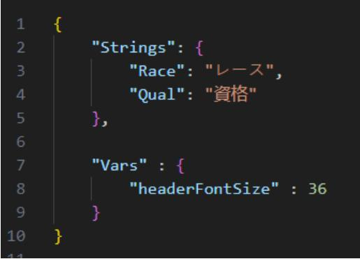

Localization **strings** are used to automatically substitute text in the markup. Any block of text enclosed in square brackets ( "[", "]" ) will be marked as being localized. The renderer will look for matching text as a key in the Strings pair in the current localization file (which is userselectable).

Example:

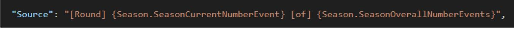

if german.json is (and user choosed germanlocalization):

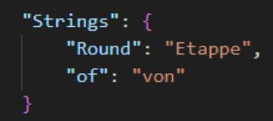

"Source" will be converted to (the app will automatically substitute the necessary text):

If the required string is not found in the localization file, the square brackets will be cleared:

Localization **vars** fall into the common list of variables using the override mechanism (see Variables and Expressions).

theme_description.jsoncan optionally define the following properties:

- DefaultLocalizationId : string specifies the default localization.
- DisableUnspecifiedLocalization : bool value true disables the possibility to select "default, not specified" option in the list of theme localizations. Usually, the renderer provides for the use of some kind of localization as an additional functionality, an add-on on top of the normal behavior of the theme. In this case, it is possible to use the theme without selecting any localization. However, you can define this property with the value true if you need to be sure to use some localization.

# **Appendix**

You can find a description of the data objects, render types, etc. on the GitHub page: https://github.com/vlad-men/RacingLeagueTools_RendererAPI

